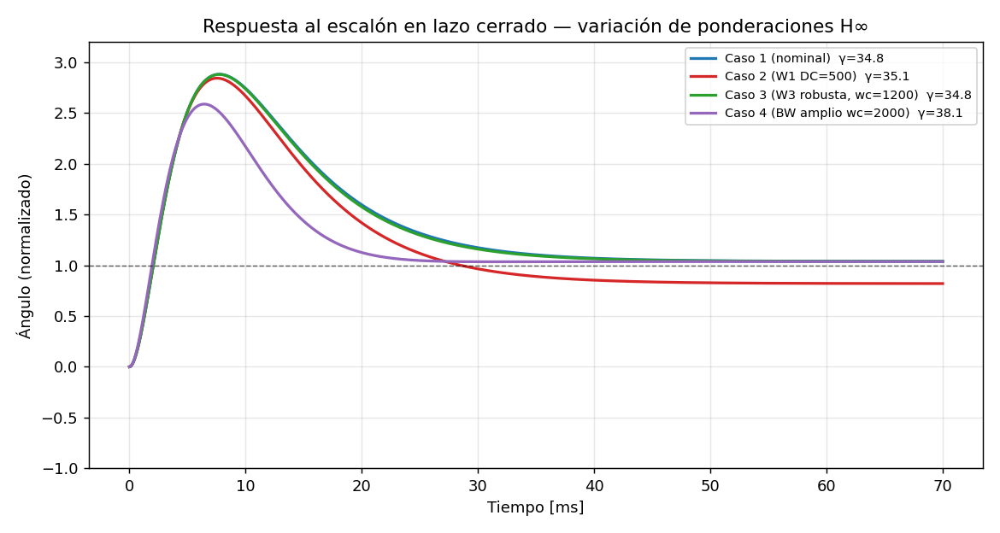

# Control H-infinito — Péndulo con rueda de reacción

Diseño de un controlador **H∞ por mezcla de sensibilidades** (mixed-sensitivity
S/KS/T) para estabilizar un péndulo con rueda de reacción, una planta
**inestable**. Incluye variación de las funciones de ponderación, gráficas
comparativas y métricas.

## Archivos

- `control_hinf_pendulo.m` — script MATLAB autocontenido. Genera todas las
  gráficas y métricas.
- `images/hinf_step_compare_ref.png` — figura de referencia de la respuesta al
  escalón de los 4 casos (generada en validación).

## Requisitos (importante)

**Solo necesita la Control System Toolbox** (`tf`, `ss`, `feedback`, `step`,
`margin`, `stepinfo`, `c2d`, …) + MATLAB base (`schur`, `ordschur`, `eig`).

**No requiere la Robust Control Toolbox.** Las funciones `makeweight`, `augw` y
`hinfsyn` (que pertenecen a esa toolbox) están reimplementadas como funciones
locales al final del script:

- `local_makeweight` — peso de primer orden con cruce a 0 dB en la frecuencia
  indicada.
- `local_augw` — planta generalizada de mezcla de sensibilidades S/KS/T.
- `local_hinfsyn` — controlador central H∞ por el algoritmo de las **dos
  ecuaciones de Riccati** (Doyle–Glover–Khargonekar–Francis), con bisección en
  γ; las Riccati se resuelven por descomposición de **Schur** del Hamiltoniano.

> Si dispone de la Robust Control Toolbox, puede sustituir las llamadas
> `local_makeweight/local_augw/local_hinfsyn` por `makeweight/augw/hinfsyn`
> (la sintaxis es equivalente) y borrar las funciones locales.

## La planta y por qué es difícil

Con los parámetros dados, la función de transferencia $V(s)\to\theta(s)$ es

$$
G(s)=\frac{0.001594}{1.293\times10^{-6}\,s^2-0.2433}
$$

Sus polos son $s=\pm 433.7$ rad/s. **Hay un polo en el semiplano derecho**
(inestable, por el término de gravedad $-m_p g \ell_g$).

**Implicación de diseño fundamental:** para estabilizar una planta con un polo
inestable en $p$, el lazo cerrado debe tener un ancho de banda *superior* a $p$.
Aquí $p\approx 434$ rad/s, así que:

- Las ponderaciones se colocan con frecuencias de cruce de **~1000–3000 rad/s**,
  **no ~1 rad/s** como en el ejemplo base. Con cruces lentos el problema H∞ no
  estabiliza la planta.
- La respuesta al escalón vive en **escala de milisegundos** (por eso las
  gráficas se simulan hasta ~70 ms).

## Nociones básicas de control H∞

**Norma H∞.** Para un sistema estable $M(s)$, la norma H∞ es el pico de su
ganancia sobre todas las frecuencias: $\lVert M\rVert_\infty=\max_\omega
\sigma_{\max}(M(j\omega))$. Es la "peor amplificación" que el sistema puede
producir. Minimizarla = limitar el peor caso.

**Planta generalizada.** El problema se plantea sobre una planta aumentada
$P$ que conecta:
- entradas exógenas $w$ (referencia/perturbación) y de control $u$;
- salidas de desempeño $z$ (señales ponderadas que queremos pequeñas) y
  medida $v$ (lo que ve el controlador).

Buscamos $K$ que estabilice y minimice $\lVert T_{zw}\rVert_\infty$, la norma
de la transferencia de $w$ a $z$.

**Mezcla de sensibilidades (lo que hace `augw`).** Aquí $z=\begin{bmatrix}
W_1 S\\ W_2 KS\\ W_3 T\end{bmatrix}$ con:
- $S=\dfrac{1}{1+GK}$ — **sensibilidad**: error de seguimiento y rechazo de
  perturbaciones. La queremos pequeña en **baja** frecuencia.
- $T=\dfrac{GK}{1+GK}$ — **sensibilidad complementaria**: $S+T=1$. La queremos
  pequeña en **alta** frecuencia (ruido + robustez).
- $KS$ — **esfuerzo de control**.

**Las ponderaciones $W_1,W_2,W_3$.** Como $\lVert T_{zw}\rVert_\infty\le\gamma$
implica $|S|\le\gamma/|W_1|$, $|KS|\le\gamma/|W_2|$, $|T|\le\gamma/|W_3|$, cada
peso *moldea* la forma deseada de su señal (loop-shaping):
- $W_1$ con **ganancia alta en baja frecuencia** ⇒ obliga a $S$ pequeña ⇒ buen
  seguimiento y rechazo de perturbaciones, error de estado estacionario bajo.
- $W_3$ con **ganancia alta en alta frecuencia** ⇒ obliga a $T$ pequeña ⇒
  robustez ante dinámica no modelada y atenuación de ruido.
- $W_2$ constante pequeña ⇒ limita el esfuerzo de control sin sobre-restringir.

`makeweight(gananciaBaja, frecCruce, gananciaAlta)` construye un peso de primer
orden con esos valores (el cruce es la frecuencia a 0 dB).

**Interpretación de $\gamma$.** Es la norma H∞ alcanzada, $\lVert
T_{zw}\rVert_\infty$. `hinfsyn` busca el $\gamma$ mínimo posible.
- $\gamma\lesssim 1$: todas las especificaciones ($1/W_i$) se cumplen.
- $\gamma>1$: las especificaciones se cumplen *relajadas en factor* $\gamma$;
  el problema es exigente. En **plantas inestables y rápidas como esta**, un
  $\gamma$ de varias decenas es normal y *no* indica un error de diseño.

**¿Por qué funciona para plantas inestables?** H∞ no necesita que la planta sea
estable: solo requiere que sea **estabilizable y detectable**. La síntesis
(vía dos ecuaciones de Riccati) construye internamente un controlador que
*estabiliza* el lazo y, sujeto a eso, minimiza la norma. La estabilidad interna
es una restricción del problema, no una hipótesis sobre la planta.

## Resultados de la variación de parámetros

Métricas obtenidas en la validación (γ y sobreimpulso son indicativos; los
valores exactos los dará `hinfsyn` de MATLAB):

| Caso | Cambio | γ | t_subida | Sobreimpulso | error e.e. |
|------|--------|------|----------|--------------|------------|
| 1 nominal | equilibrio | ~35 | ~1.3 ms | ~177 % | ~0.04 |
| 2 W1 DC=500 | ↑ ganancia DC de W1 | ~35 | ~0.8 ms | ~247 % | ~0.18 |
| 3 W3 wc=1200 | T penalizada antes | ~35 | ~1.4 ms | ~178 % | ~0.04 |
| 4 BW amplio | ↑ ancho de banda | ~38 | ~1.6 ms | ~150 % | ~0.04 |



**Comentarios:**

1. **Compromiso seguimiento ↔ sobreimpulso (limitación de fondo).** Subir la
   ganancia DC de $W_1$ (Caso 2) exige menor error estacionario, pero **aumenta
   el sobreimpulso**. No es un defecto del ajuste: un polo en el semiplano
   derecho impone, por las integrales de Bode/Poisson (efecto *waterbed*), un
   sobreimpulso/subimpulso inevitable. Cuanto más se exige en seguimiento, más
   se paga en transitorio.

2. **Robustez (Caso 3).** Penalizar $T$ desde una frecuencia menor hace el lazo
   más conservador (menos ganancia en alta frecuencia, mejor margen frente a
   dinámica no modelada), a costa de algo de velocidad.

3. **Ancho de banda (Caso 4).** Subir los cruces de $W_1$ y $W_3$ acelera el
   lazo; aquí ya estamos cerca del límite que impone el polo inestable, por lo
   que la ganancia en velocidad es marginal y el esfuerzo de control crece.

4. **$\gamma\approx 35$ en todos los casos:** refleja que las especificaciones
   de mezcla de sensibilidades entran en conflicto fuerte sobre una planta tan
   rápida e inestable. Aun así, **el lazo cerrado es estable y sigue la
   referencia** ($\mathrm{dcgain}(T)\approx 1$) en los casos con $W_1$ de
   ganancia DC alta.

## Cómo ejecutar

```matlab
>> cd labs/lab_hinf_pendulo
>> control_hinf_pendulo
```

Requiere MATLAB reciente con **Control System Toolbox** y **Robust Control
Toolbox**.
